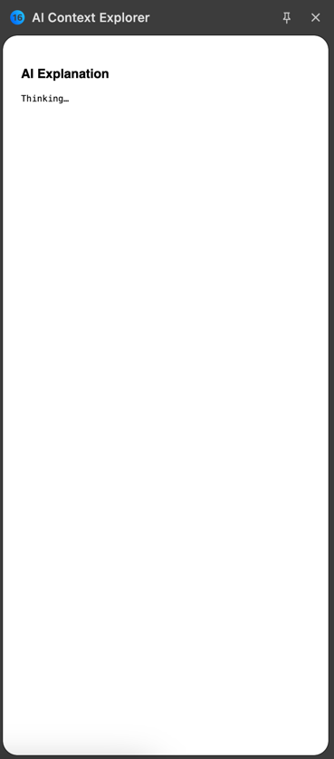
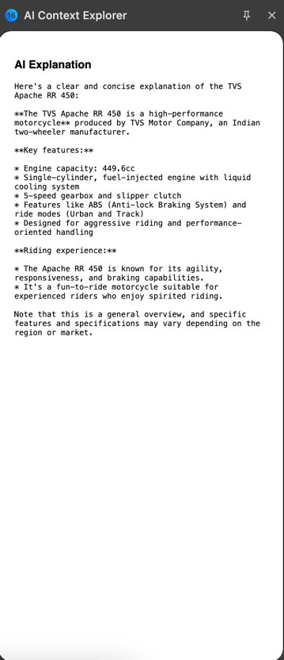

# AI Context Explorer Chrome Extension (Local AI with Ollama)

A **minimal Chrome extension** that lets you **select text on any webpage**, right-click, and get an **instant explanation** using a **local Ollama LLM**.

This project is intentionally **small and focused**:

* No cloud APIs
* No accounts or API keys
* No diagram parsing or infra generation

Just **click → explain → done**.

---

## What This Extension Does

* Capture selected text on a webpage
* Add a right-click context menu option
* Open Chrome Side Panel
* Send text to a **local Ollama model**
* Display the explanation

---

## How It Works

```
User selects text
   ↓ (Right-click)
Context menu: "Explain with AI"
   ↓
Background script calls Ollama (localhost)
   ↓
Side panel shows AI response
```

---

## Screenshots (Add When Available)

### 1. Text selection + right-click

```

```

### 2. Side panel opens

```

```

### 3. Local AI explanation

```

```

---

## Prerequisites

### Install Ollama

```bash
https://ollama.com
```

Verify:

```bash
ollama --version
```

---

### Pull a model

Recommended (fast + light):

```bash
ollama pull llama3.2:3b
```

Alternative (better quality):

```bash
ollama pull llama3.1:8b
```

---

### Start Ollama (Allow Chrome Extension)

Chrome extensions send a special origin header. Allow it explicitly:

```bash
OLLAMA_ORIGINS=chrome-extension://* ollama serve
```

> ⚠️ Local development only

---

## Chrome Extension Setup

1. Open Chrome → `chrome://extensions`
2. Enable **Developer Mode**
3. Click **Load unpacked**
4. Select this project folder

---

## Project Files

```
.
├── manifest.json     # Extension config
├── background.js     # Context menu + Ollama fetch
├── sidepanel.js      # UI logic
├── sidepanel.html    # Side panel layout
└── README.md
```

---

## Why Ollama

* Runs fully locally
* No API keys
* No rate limits
* Works offline
* Ideal for dev / research / internal tools

---

## Common Issues

### ❌ 403 Forbidden in Ollama logs

Cause: Chrome extension origin blocked

Fix:

```bash
OLLAMA_ORIGINS=* ollama serve
```

---

### ❌ `Unexpected end of JSON input`

Cause: Ollama streaming response

Fix:

```js
stream: false
```

Parse via `response.text()` before `JSON.parse()`.

---

### ❌ Side panel does not open

Cause: `sidePanel.open()` must be triggered by a user gesture

Fix: Call it only from the **context-menu click handler**.

---

## Scope (Intentional)

This extension is **only** for:

* Click → explain
* Local AI usage
* Side panel UX

No logging, no storage, no tracking.

---

## License

MIT

---

This project is meant to be simple, hackable, and easy to extend.
